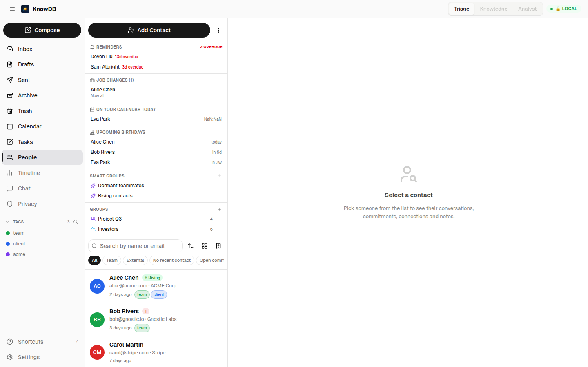

# Phase 2 — Tags & Organization

> *One chip, three surfaces. A tag on Alice's card is a tag on Alice's threads is a tag on Alice's invites.*

---

## The product principle

Every tag system in a contacts app is a lie of categorization. You tag Alice as `team`, and then six weeks later you can't find the thread where she promised the Q3 numbers because tags don't live on threads in that app. Or you tag the thread, but Alice's card doesn't remember you cared. **The substrate already says these are the same person — the tag system must agree.**

So in KnowDB v0.4.0, tags are a single primitive shared by **entities**, **threads**, and **events**. One `tag_definitions` table, one `<TagChip />` component, three target-typed join tables. Attach `team` to Alice; it appears on her inbox row and her calendar invites. Attach `acme` to a thread; the thread carries it everywhere it shows up. Attach `team-event` to a calendar event; the event is filterable from anywhere.

---

## Schema

Three migrations carry this phase:

```sql
-- 0009_tag_definitions_and_target_tags.sql
CREATE TABLE tag_definitions (
  id          UUID PRIMARY KEY DEFAULT uuid(),
  name        VARCHAR NOT NULL UNIQUE,
  color       VARCHAR NOT NULL DEFAULT '#888',
  scope       VARCHAR NOT NULL DEFAULT 'global',  -- future: 'private' | 'shared'
  created_at  TIMESTAMP NOT NULL DEFAULT NOW()
);

CREATE TABLE entity_tags (entity_id UUID, tag_id UUID, attached_at TIMESTAMP DEFAULT NOW(),
                          PRIMARY KEY (entity_id, tag_id));
CREATE TABLE thread_tags (thread_id UUID, tag_id UUID, attached_at TIMESTAMP DEFAULT NOW(),
                          PRIMARY KEY (thread_id, tag_id));
CREATE TABLE event_tags  (event_id  UUID, tag_id UUID, attached_at TIMESTAMP DEFAULT NOW(),
                          PRIMARY KEY (event_id, tag_id));

-- 0012_entity_groups_and_members.sql
CREATE TABLE entity_groups (
  id          UUID PRIMARY KEY DEFAULT uuid(),
  name        VARCHAR NOT NULL UNIQUE,
  description VARCHAR,
  color       VARCHAR DEFAULT '#888',
  created_at  TIMESTAMP NOT NULL DEFAULT NOW()
);
CREATE TABLE entity_group_members (group_id UUID, entity_id UUID, added_at TIMESTAMP,
                                   PRIMARY KEY (group_id, entity_id));

-- 0013_smart_groups_saved_views.sql
CREATE TABLE smart_groups (
  id          UUID PRIMARY KEY DEFAULT uuid(),
  name        VARCHAR NOT NULL UNIQUE,
  filter_json JSON NOT NULL,
  created_at  TIMESTAMP NOT NULL DEFAULT NOW()
);

CREATE TABLE saved_views (
  id          UUID PRIMARY KEY DEFAULT uuid(),
  name        VARCHAR NOT NULL,
  surface     VARCHAR NOT NULL,   -- 'people' | 'inbox' | 'calendar'
  sort_json   JSON,
  filter_json JSON,
  columns_json JSON,
  is_default  BOOLEAN DEFAULT FALSE,
  created_at  TIMESTAMP NOT NULL DEFAULT NOW(),
  UNIQUE (name, surface)
);
```

The shape: **one definition table, many target tables**. Adding a new taggable target (e.g. `attachment_tags` in v0.5) is one migration + one MCP overload — no UI change.

---

## MCP surface

```
list_tags()                           → tag_definitions ranked by attachment count
create_tag(name, color)               → upsert by name
update_tag(id, name?, color?)         → rename / recolour
delete_tag(id)                        → cascades to all target tables
attach_tag(tag_id, target_type, target_id)   → idempotent upsert
detach_tag(tag_id, target_type, target_id)   → idempotent delete

list_groups()                                → entity_groups + member count
create_group(name, description?, color?)     → upsert
update_group(id, name?, description?, color?)
delete_group(id)                              → cascade to members
add_to_group(group_id, entity_id)
remove_from_group(group_id, entity_id)

list_smart_groups()                          → smart_groups + last-evaluated count
create_smart_group(name, filter_json)
delete_smart_group(id)
evaluate_smart_group(id)                     → returns entity_ids by re-running stored filter

list_saved_views(surface?)                   → filter to a single surface
create_saved_view(name, surface, sort?, filter?, columns?)
update_saved_view(id, …)
delete_saved_view(id)
```

`attach_tag` / `detach_tag` are dispatched via `target_type` so the same tool serves People rows, Inbox threads, and Calendar events. The MCP server is one method, three surfaces — same shape as `find_related` or `path_between`.

---

## UI — the three surfaces

### People row

```
┌──────────────────────────────────────────────────────────────────┐
│ ◯ AC  Alice Chen                                                 │
│       alice@acme.com · ACME Corp                                 │
│       ████ team   █ client                            47 events │
└──────────────────────────────────────────────────────────────────┘
```

### Inbox thread row (same chips on the right)

```
┌──────────────────────────────────────────────────────────────────┐
│ ●  Alice Chen, Bob R., me                          Yesterday     │
│    Q3 numbers and the launch plan we need                        │
│    "Hi all — attached the updated forecast…" 12 messages         │
│    ████ team   █ client   ▓ acme                        📎 2     │
└──────────────────────────────────────────────────────────────────┘
```

### Calendar event card (same chips bottom-right)

```
┌──────────────────────────────────────────────────────────────────┐
│ 10:00 — 11:00   Q3 strategy review                               │
│ Alice Chen, Bob Rivers, you · Meet link · 5 attendees           │
│                                                          ████ team │
└──────────────────────────────────────────────────────────────────┘
```

🖼 Live screenshot — tags + groups + smart groups in the People sidebar, with `team` / `client` chips on contact rows:


---

## Smart groups

Smart groups are saved *filters*, not saved *sets*. The `filter_json` payload is the same shape `list_entities` accepts:

```json
{
  "filters": {
    "tags": ["team"],
    "is_dormant": true
  }
}
```

`evaluate_smart_group(id)` re-runs the filter on every call against current substrate. A contact tagged `team` who hasn't been emailed in 60 days enters the *Dormant teammates* group the instant they cross the threshold — no recomputation worker.

```
┌─────────────────────────────────────────────────────────────────┐
│  New smart group                                              × │
├─────────────────────────────────────────────────────────────────┤
│  Name      [ Dormant teammates                              ]   │
│                                                                 │
│  Conditions                                                     │
│   • Tag       is        [ team        ▾ ]                       │
│   • Status    is        [ dormant     ▾ ]    [ + Add condition ] │
│                                                                 │
│  Preview                                                        │
│   ▸ Carol Martin    last contact 67 days ago                    │
│   ▸ Devon Liu       last contact 89 days ago                    │
│   ▸ Eva Park        last contact 112 days ago                   │
│                                                                 │
│                                          [ Cancel ]  [ Save ]   │
└─────────────────────────────────────────────────────────────────┘
```

<!-- Smart group editor screenshot pending — drop `02-smart-group-editor.png` into screenshots/ to render it here. -->


---

## Saved views

A saved view is the **sort + filter + visible columns** combination you've built. Each surface has its own list — `surface = 'people' | 'inbox' | 'calendar'`. The URL deeplink (Phase 7 #7.6) encodes the same JSON so a saved view URL is shareable.

```
┌─────────────────────────────────┐
│   Views                       ▾ │
├─────────────────────────────────┤
│   • All people                  │
│   ★ Default (recent, no filter) │
│     Top 50 by strength          │
│     Dormant teammates           │
│     Birthdays this month        │
│     ─────────────────────────   │
│     + New from current filter   │
└─────────────────────────────────┘
```

<!-- Saved views dropdown screenshot pending — drop `02-saved-views-dropdown.png` into screenshots/ to render it here. -->


The default view is "Recent, no filter, default columns" — a fresh install behaves identically to v0.3.x.

---

## What this unlocks

- **Find "team" stuff** anywhere: in People (the row carries the tag), in Inbox (threads with `team`-tagged participants), in Calendar (events of `team`-tagged people, plus calendar events directly tagged).
- **Compose a tag-scoped reminder set** by writing a smart group filtering on a tag, then attaching a keep-in-touch reminder (Phase 4) to its members.
- **Cross-surface filters** — Inbox sidebar can filter to tag `acme`; Calendar can filter the same way; the People list does the same.

---

## Developer notes

- `attach_tag` is **upsert-on-conflict**, so it's idempotent. Auto-tag rules (Phase 7 #7.5) can call it repeatedly without bloating the join table.
- The `<TagChip />` React component reads `tag_definitions.color` on render; recoloring a tag updates every chip on the next refetch (no per-chip state).
- Smart groups are evaluated **lazily** on the read path. There's no background recomputation — so they stay correct as the substrate evolves without writing churn.
- Saved views' `is_default` is **per-surface** — having a default people view does not affect inbox or calendar.

---

## Acceptance from spec 33 — checked

✅ Tags appear identically on People, Inbox, Calendar
✅ A tag added in one surface shows up in every other surface immediately (no per-surface caching)
✅ Smart group `Dormant teammates` returns contacts with `team` tag + dormant flag
✅ Saved views CRUD on all three surfaces
✅ `list_entities` honours `sort` (`recent` | `alphabetical` | `frequency`) and `filter` (`team` | `external` | `dormant`)

---

## Cross-references

- See [`04-relationship-intelligence.md`](04-relationship-intelligence.md) for `is_dormant` / `is_rising` — the chips that smart groups can filter on.
- See [`07-power-user-polish.md`](07-power-user-polish.md) for the **rules engine** that attaches tags automatically.
- See [`05-data-sovereignty.md`](05-data-sovereignty.md) for vCard export — tags export as vCard `CATEGORIES` lines.
