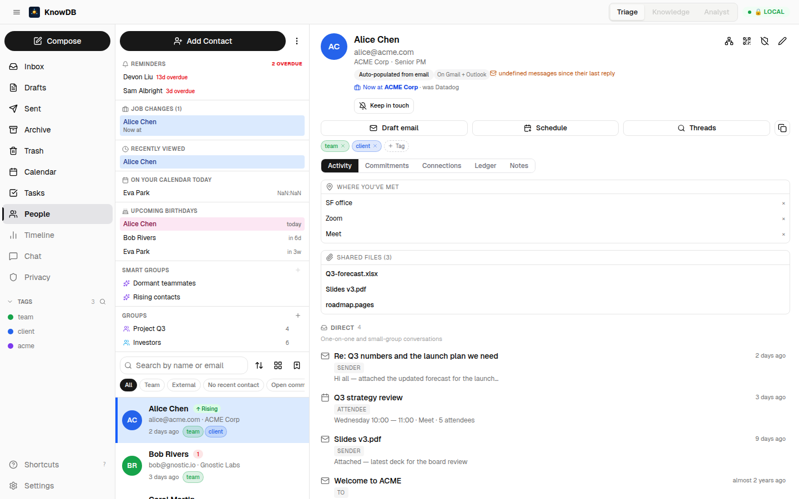

# Phase 3 — Cross-surface unified discovery

> *From any thread, one click reaches the sender's full profile. From any contact, one click reaches every meeting, file, and place you've shared.*

---

## The dead-end problem

In a normal client, the inbox is a dead-end. You read an email from Alice and you can see *that* email. To answer "what else has Alice and I been working on?" you need a second app, a second search, and the patience to mentally union the results. The substrate already knows the answer — the user shouldn't have to ask three times.

Phase 3 is the *navigation* layer. Every surface that mentions Alice now offers one-click escape hatches to her full identity, and her identity offers one-click drilldowns to every adjacent surface.

---

## What shipped

### From an inbox thread → into People

- Clicking a sender's name in any thread opens that contact's panel in-place (no full navigation, no lost context). Uses a shared `selectContact` store action so both Inbox and People react to the same selection.
- Hover preview on the sender shows the same quick-look card the People list uses.

### From a contact → into Calendar

- **"Schedule meeting with"** button on ContactDetail opens the new-event calendar modal with Alice pre-filled as the only attendee. The compose modal's normal conferencing logic (auto-Meet for Google, auto-Teams for Microsoft) applies.
- **"Upcoming meetings with"** card — next 5 calendar events containing this entity, sorted ascending.

### From a contact → into Compose

- **Compose** button on ContactDetail opens the composer with `To: alice@acme.com` and, in the side panel, **the last 3 thread subjects** between you and Alice as context (not auto-quoted, just visible) so you can pick up the conversation without hunting.

### Cards on ContactDetail (derived views, no new schema)

```
┌─────────────────────────────────────────────────────────────────┐
│   Alice Chen                                            ⋯   ↗   │
│   ACME Corp · Senior PM                                         │
│   alice@acme.com  +1 415 555 0100                               │
│                                                                 │
│   Strength ▰▰▰▰▰▱▱  ↗ rising      ⏰ Due to ping in 4 days       │
├─────────────────────────────────────────────────────────────────┤
│                                                                 │
│   ◤ Activity (Direct)              ◢ Also mentioned in          │
│   ───────────────────              ─────────────────────────    │
│   2d ago  Re: Q3 numbers (12)      5d  Project Atlas kick-off   │
│   5d ago  Calendar invite (1h)     1w  Bob R. → all-hands       │
│   1w ago  Slides v3.pdf (📎)       2w  Eva P. → eng-leads       │
│                                                                 │
│   ◤ Upcoming meetings              ◢ Where we've met            │
│   ───────────────────              ─────────────────────────    │
│   Wed 10:00  Q3 review             SF office  · 14 events       │
│   Fri 14:00  1-on-1                Zoom       ·  9 events       │
│   Mon 09:00  Eng staff             Meet       ·  5 events       │
│                                                                 │
│   ◤ Files shared (9)                                            │
│   ───────────────────                                           │
│   Q3-forecast.xlsx  · 2d ago · in "Re: Q3 numbers"              │
│   Slides v3.pdf     · 1w ago · in "Project Atlas"               │
│   roadmap.pages     · 2w ago · in "Q2 retro"                    │
│   ▸ Show all 9                                                  │
└─────────────────────────────────────────────────────────────────┘
```

🖼 Live screenshot — ContactDetail rendered against the rich Phase-3 fixture (timeline + meetings + connections + activity tabs all driven by real MCP responses):


Each card is a derived view over the substrate — `metadata.location`, `metadata.attachments`, scoped to the entity's `mentions`. No new tables needed.

### Inbox People-Mode

A toggle on the inbox switches between **Thread mode** (default — chronological threads) and **People mode** — threads grouped by primary sender entity, each entity collapsible.

```
┌───────────────────────────────────────────────┐
│  Inbox                              ⋮  ☰      │
│  [ Threads ●  People ○ ]                      │
├───────────────────────────────────────────────┤
│  ▾ Alice Chen                       47        │
│    ● Re: Q3 numbers                  Yesterday│
│    ● Calendar: Q3 review              5d ago  │
│    ○ Welcome to ACME                  3w ago  │
│  ▸ Bob Rivers                       28        │
│  ▸ Carol Martin                     17        │
│  ▸ Devon Liu                        14        │
└───────────────────────────────────────────────┘
```

<!-- Inbox People-mode screenshot pending — drop `03-inbox-people-mode.png` into screenshots/. -->


### Birthdays

- ContactEditDrawer gains a **Birthday** field (writes to `entity_custom_fields` with `key='birthday'`).
- A dedicated **Birthdays** tab on the People view lists the next 30 days, ascending.
- The nightly scheduler mints calendar events at 7 / 1 / 0 days ahead with `source='knowdb_birthday'` so they show up on the calendar grid.

<!-- Birthdays tab screenshot pending — drop `03-birthdays-tab.png` into screenshots/. -->


### Quick-look hover preview

Hover any row in the People list (or any sender in the Inbox) and a 250 ms-delayed preview popover appears anchored to the row. Same component, both surfaces. Click-through opens the full ContactDetail.

<!-- Quick-look hover screenshot pending — drop `03-quick-look-hover.png` into screenshots/. -->


### Email templates

Compose toolbar grew a templates dropdown. Templates support `{{first_name}}`, `{{company}}`, `{{last_subject}}` variables that interpolate against the current draft's primary recipient. Templates live in a new `entity_templates` table (one shared library; future tables can scope to entity / group / smart-group).

---

## MCP surface additions

```
contact_upcoming_meetings(entity_id, limit?)      → next N calendar events
contact_meeting_locations(entity_id)              → distinct locations + counts
contact_shared_attachments(entity_id, limit?)     → distinct attachments via mentions
people_on_calendar_today()                        → entities with a calendar event today
list_upcoming_birthdays(days?)                    → next N days of birthdays
```

All read-only, all routed through the reader pool.

---

## What the user gets

A four-minute task — *"send Alice the Q3 deck with a quick note about Friday's review"* — used to require: search inbox → find thread → copy attachment → switch to People → find Alice's address → switch to Compose → type subject → write. Now: People → search "Alice" → "Compose" with last subject already visible as context → drop attachment from "Files shared" → send.

The substrate already had every join. Phase 3 puts them at the right depth from the right places.

---

## Developer notes

- All the cross-surface cards are **derived** — they read existing columns rather than denormalizing into new ones. Refactoring an underlying field doesn't break them.
- The shared `selectContact` action is a single zustand store; both Inbox and People subscribe. Don't introduce a separate selection for ContactDetail without coordinating, or the panels drift.
- The nightly scheduler runs in a dedicated tokio task at 03:00 local; the birthday job is idempotent (`source='knowdb_birthday'` + Message-ID match prevents duplicate event rows on rerun).
- Quick-look preview uses the same hover-delay (250 ms) as the inbox sender popover for consistency.

---

## Acceptance from spec 33 — checked

✅ From any email in the inbox, one-click to the sender's profile
✅ ContactDetail surfaces shared meetings, files, and locations
✅ "Schedule meeting with" opens calendar modal with attendee prefilled
✅ Birthdays land in calendar view + dedicated People tab
✅ Quick-look hover on contact rows
✅ Email templates with variables

---

## Cross-references

- See [`04-relationship-intelligence.md`](04-relationship-intelligence.md) for the signals (strength, dormant, rising) that the cards in this phase display.
- See [`07-power-user-polish.md`](07-power-user-polish.md) for keyboard nav across surfaces (`j`/`k` to walk the inbox while ContactDetail stays open in side-panel).
