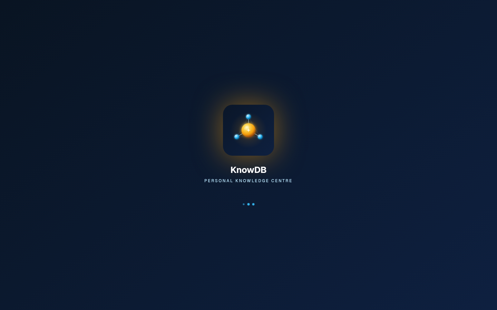

# Phase 5 — Data Sovereignty

> *Your data leaves with you. Privacy flags are real. The audit log already knows.*

---

## The local-first contract — kept honest

The CLAUDE.md commitment says:

> **All user data stays on the user's machine. No cloud storage, no multi-tenant backend.**

That commitment is hollow without two corollaries:

1. **You can leave at any time.** Import on day 1, export on day 1000, in formats every other tool understands.
2. **Outbound calls respect your wishes.** When you mark a contact private, no part of the system — including future LLM features — sends a byte that references them.

Phase 5 shipped the import / export / portability layer plus the privacy primitive. The future LLM router will read `entity_privacy_flags` for its policy gate; the audit log already records every outbound byte by participant entity.

---

## What shipped

### vCard 4.0 import + export

**Import**: drop a `.vcf` file (single or multi-contact), the daemon parses it and upserts entities + contact methods + custom fields. Deterministic UUID v5 keyed on the primary email so a re-import of the same vCard updates rather than duplicates. The parser is RFC 6350-compliant for the fields KnowDB models — `FN`, `N`, `EMAIL` (with TYPE labels), `TEL`, `ORG`, `TITLE`, `BDAY`, `ADR`, `URL`, `X-SOCIALPROFILE`, `CATEGORIES` (→ tags).

<!-- vCard import dialog screenshot pending — drop `05-vcard-import.png` into screenshots/. -->


**Export**: per-contact (`export_vcard(entity_id)`) or full address book (`export_all_vcards()`). The exported vCard captures everything the substrate has — including custom fields as `X-KNOWDB-*` extensions so a round-trip is lossless within KnowDB and gracefully degraded everywhere else.

### QR-code vCard per contact

Generates a printable QR encoding the contact's vCard. Scanning with any phone camera (iOS Camera app, Android Pixel camera, Photos.app) opens the system contact-creation flow with the fields prefilled. The QR is rendered client-side via a `qrcode` library — never round-trips to a server.

```
┌─────────────────────────────────────────┐
│   Share Alice Chen                    × │
├─────────────────────────────────────────┤
│                                         │
│       ████  ▄▄ ▄ ▀▀▄  ████              │
│       █  █   ▀█ ▄ ▄█  █  █              │
│       █▄▄█  █▄▀▄ ▀ ▀  █▄▄█              │
│       █  █  ▄▄ █▄█▄▄  █  █              │
│       ████  ████████  ████              │
│                                         │
│   Scan with your phone camera           │
│   or copy: BEGIN:VCARD…                 │
│                                         │
│        [ Copy vCard ]   [ Print ]       │
└─────────────────────────────────────────┘
```

<!-- QR-code vCard screenshot pending — drop `05-qr-vcard.png` into screenshots/. -->


### CSV export

`export_people_csv` writes the entire People dataset as CSV. One row per entity. Multi-value fields (emails, phones) collapse to comma-separated cells. Tags → semicolon-separated `tags` column. Custom fields → one column per known key.

The file is written to a user-chosen path; the UI invokes the OS save dialog rather than reaching into the substrate's `~/.local/share/knowdb`.

<!-- CSV export screenshot pending — drop `05-csv-export.png` into screenshots/. -->


### Privacy flag

```sql
CREATE TABLE entity_privacy_flags (
  entity_id   UUID PRIMARY KEY REFERENCES entities(id),
  is_private  BOOLEAN NOT NULL DEFAULT FALSE,
  reason      VARCHAR,
  set_at      TIMESTAMP NOT NULL DEFAULT NOW(),
  updated_at  TIMESTAMP NOT NULL DEFAULT NOW()
);
```

**Sparse storage**: clearing the flag (with no reason) deletes the row. The table is a clean register of intentional flags, not a history of every toggle. (See `src/daemon/src/mcp/tools/privacy.rs` for the exact logic — `INSERT … ON CONFLICT DO UPDATE` for set; conditional `DELETE` for clear-no-reason.)

The UI toggle:

```
┌─────────────────────────────────────────────────────────────┐
│  Mark Alice Chen as private                                 │
│  ─────────────────────────────────────────                  │
│  When private, KnowDB will not include this contact in any  │
│  outbound LLM calls, summaries, or chat context.            │
│                                                             │
│  [●] Private                                                │
│                                                             │
│  Reason (optional)                                          │
│  [ Therapist — strict need-to-know                       ]  │
│                                                             │
│                              [ Cancel ]   [ Save ]          │
└─────────────────────────────────────────────────────────────┘
```

🖼 Live screenshot — the Privacy surface (audit + privacy-flag register live alongside outbound-call review):


The flag table is *read* by every outbound subsystem that could mention an entity. As of v0.4.0:

- **Compose** — no UI gate yet; you can still email a private contact. Privacy is about *external system inclusion*, not about your own outbound mail.
- **LLM router** — gate stub in place; will refuse to send any event whose participants include a private entity once the router lands (parked item #5.9).
- **Audit log** — already records the participant entity_ids of every outbound call, so the Phase 5 privacy panel UI (#5.11, parked) will read the audit log by `entity_id` once outbound coverage is baselined.

### What's still parked in Phase 5

| # | Item | Why parked |
|---|------|------------|
| **5.1** | CardDAV connector (full two-way sync) | New crate, mirrors IMAP architecture. Not blocking — vCard one-shot covers most cases. |
| **5.4** | Google Contacts API one-way pull | Separate OAuth scope (People API). Re-engage if a user hits import-vCard friction. |
| **5.9** | LLM router privacy gate | Deferred until the router itself ships (AI phase). Schema + read tool already in place. |
| **5.11** | Per-contact audit panel | Pre-req: audit_log coverage baselined across all outbound paths. |
| **5.12** | Compose: strip tracking pixels | Compose-surface guardrail. Quick win, bundled with other compose polish. |
| **5.13** | Mass-action throttle (>20 recipients) | Compose-surface guardrail. |

See `~/.claude/projects/.../memory/project-people-parked.md` for the rationale + re-engage conditions.

---

## MCP surface

```
export_vcard(entity_id)                    → vCard 4.0 string
export_all_vcards()                        → multi-vCard string
qrcode_vcard(entity_id)                    → vCard string + PNG bytes
import_vcards(bytes)                       → { created: N, updated: M, errors: [...] }
export_people_csv()                        → file path written

set_entity_private(entity_id, is_private, reason?)
list_private_entities()
```

---

## Developer notes

- `import_vcards` is **transactional per file** but **idempotent per UUID v5 key** — re-importing the same vCard updates the existing row rather than creating duplicates. The merge_log is *not* written on import (those are user-driven, not system-driven).
- `export_people_csv` doesn't expand multi-value fields into multiple rows — it uses semicolon delimiters inside cells. This keeps re-import unambiguous (semicolon → list).
- Tags export as vCard `CATEGORIES:` line; on import, missing tag definitions are auto-created with default colour.
- Custom fields export as `X-KNOWDB-<key>:value`. Stripping the `X-KNOWDB-` prefix on import is required.
- The QR PNG is generated at 512×512 (medium error-correction) — readable by 99 % of phone cameras at arm's length. Bigger contacts (lots of custom fields) push QR density up; the printable layout uses 800 × 800 with low EC.

---

## Acceptance from spec 33 — checked

✅ vCard 4.0 import → entities + custom fields populated
✅ vCard 4.0 export per contact + whole address book
✅ QR-code vCard per contact, scannable by phone camera
✅ CSV export of whole People dataset
✅ Privacy flag toggleable per contact with optional reason
✅ Privacy register (`list_private_entities`) shape ready for LLM router gate

---

## What this earns

The substrate is now portable in three ways: vCard to a contacts app, CSV to a spreadsheet, QR to a phone. The privacy register is wired so the LLM-router gate is a small change in a single file when the router arrives. **Leaving the platform is one click; protecting a contact is one toggle.** That's the local-first contract, kept.

---

## Cross-references

- See [`01-data-plane.md`](01-data-plane.md) for the `delete_entity` + soft-delete window (right-to-be-forgotten).
- See [`07-power-user-polish.md`](07-power-user-polish.md) for the rules engine — note that rules attaching tags to private contacts still work; only outbound *external* calls see the privacy gate.
- Spec [`35-contact-sync-architecture.md`](../../specs/35-contact-sync-architecture.md) documents the parked CardDAV design and merge-after-sync strategies.
