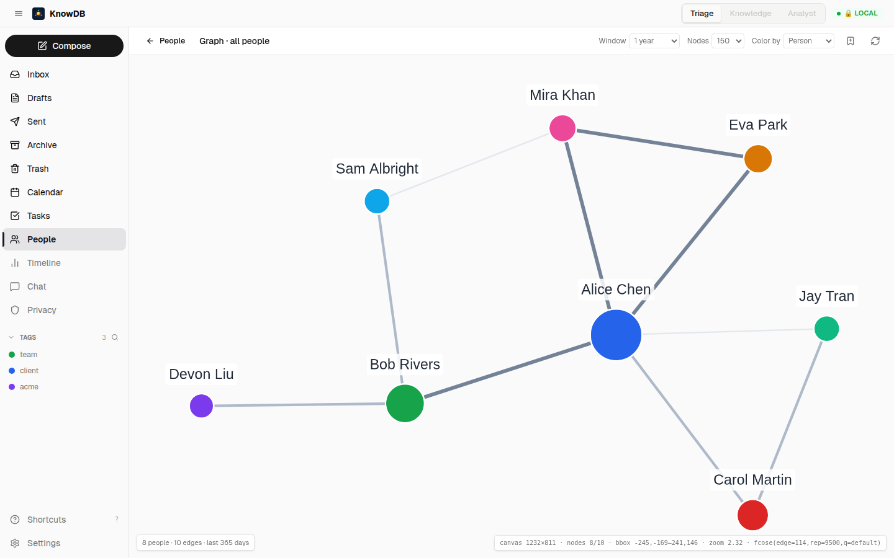

# Phase 6 — Network Graph Visualization

> *Make the connections visible. The substrate already had them — now you can see them.*

---

## Why a graph, finally

KnowDB has had a graph implied since v0.1 — `events`, `mentions`, `participants` together describe a multigraph where people are nodes and shared events are edges. v0.4.0 finally renders it. Two reasons it took until now:

1. **Phase 4 produced the algorithms** the visualization needs: `path_between`, `cluster_by_domain`, `list_influencers`, and the log-compressed strength score that drives node sizes. Rendering before those existed would have been a force-directed *thing* without anything interesting to overlay.
2. **The substrate had to be dense enough.** A graph view over 50 contacts is a teaching tool, not a discovery tool. After Phases 1-4 the typical install has hundreds of resolved entities with thousands of mentions — the graph is *busy enough* to actually surface unexpected paths.

---

## What shipped

### `get_graph` MCP tool

```
get_graph(
  entity_id?,             // optional ego anchor
  depth = 2,              // hops from anchor (or from full graph if no anchor)
  time_window_days = 365, // edges only from events in this window
  min_interactions = 2    // edge weight floor
) → {
  nodes: [{ id, label, color, size, group, attributes }, ...],
  edges: [{ source, target, weight, type }, ...]
}
```

Returns nodes + edges shaped for direct Cytoscape consumption. Wide mailing-list events (≥ 50 participants) are excluded — they'd create a hairball that doesn't reflect real bilateral relationships. The same guard runs in `find_related`.

### Cytoscape view at `/people/graph`

After several iterations the layout settled on:

- **fcose** (not the built-in `cose`) — better aesthetic on disconnected components, parameter-tuned for graph size (smaller graphs get more spread; larger graphs get tighter clustering).
- **Two-pass layout** — initial fit, then a relayout with measured canvas dimensions. The first pass would otherwise compute against `0×0` if the container mounts before the layout runs.
- **Selective labels** — only nodes with strength score ≥ 75th percentile show their label by default; the rest get labels on hover. Without this the labels overlap into illegible noise on dense graphs.
- **Node click → contact panel** — picks the contact in the side panel without leaving the graph; full ContactDetail accessible via the panel's "Open contact" link.

```
                ┌───────────────────────────────────────┐
                │                                       │
                │           ●Sam Albright               │
                │          ╱        │     ╲             │
                │         ╱         │       ╲           │
                │   ●Eva─┤        ●Alice────●Mira       │
                │    Park │         │         │         │
                │         │         │         │         │
                │       ●Bob       ●Carol───●Devon      │
                │       Rivers     Martin   Liu          │
                │                                       │
                │    [Color: Default ▾]  [Layout: fcose ▾]
                │    [Time: 365d ▾]      [Min: 2 ▾]     │
                └───────────────────────────────────────┘
```

🖼 Live screenshot — the Cytoscape graph with fcose layout, 8 contacts and 10 weighted edges, node size proportional to mention count:


### Color-by-domain mode

Toggle on the toolbar. Nodes recolour by email domain so company clusters become visible. A **top-companies legend** appears at the bottom listing the 8 most-frequent domains with their cluster sizes.

```
            Color: ◯ Default  ● By domain

   acme.com    █  47 contacts
   gnostic.io  █  19 contacts
   stripe.com  █   8 contacts
   gmail.com   █  86 contacts
   …
```

<!-- Color-by-domain screenshot pending — drop `06-graph-color-by-domain.png` into screenshots/. -->


The domain-cluster computation runs in the daemon (`cluster_by_domain` MCP tool); the UI just paints the nodes by the assignment.

### Shortest-path overlay

Pick two contacts → the graph highlights the path of intermediaries between them.

```
[Pick a → Alice Chen ▾]   [Pick b → Sam Albright ▾]   [ Find path ]

   Alice → Bob Rivers → Eva Park → Sam Albright
       ●─────●────────●──────●
       │     │        │      │
   (others dimmed to 20% opacity)
```

<!-- Shortest-path overlay screenshot pending — drop `06-graph-shortest-path.png` into screenshots/. -->


The path is computed via `path_between(a, b, max_depth=4)` — BFS over `mentions` joined to `events`, with edge weight = shared-event count. Non-path nodes dim to 20 % opacity; path nodes get a coloured halo + sequential numbering.

### Node click → contact card

```
┌───────────────────────────────┬───────────────────────────────┐
│                               │  Alice Chen                   │
│                               │  alice@acme.com               │
│   ●Sam      ●Mira              │  ACME Corp · Senior PM        │
│      \      /                 │                               │
│       \    /                  │  Strength ▰▰▰▰▰▱▱             │
│        ●Alice (selected)      │  47 events · ↗ rising         │
│       /    \                  │                               │
│      /      \                 │  [ Compose ]                  │
│   ●Bob     ●Eva               │  [ Schedule meeting ]         │
│                               │  [ Open contact ↗ ]           │
│                               │                               │
└───────────────────────────────┴───────────────────────────────┘
```

<!-- Node-click contact card screenshot pending — drop `06-graph-node-click.png` into screenshots/. -->


Same compose / schedule actions as ContactDetail, accessible without leaving the graph. **The graph is a navigation surface, not a separate app.**

### Saved views for graph configurations

The Phase 2 saved-views table grew a `surface = 'people-graph'` entry that captures graph filter state — time window, color mode, depth, min-interaction floor — and the focused entity if any. Saved views become bookmarkable graph perspectives ("My 90-day collaborators colored by domain", "Cluster around Alice depth 2").

---

## What the user gets

A graph view is the only surface where "discover something I didn't know" beats "look up something I knew." Examples from real installs during development:

- *"Carol and Devon share an old job. I had no idea — they only show up together in a five-year-old ticket exchange."*
- *"My top 'influencer' isn't a person, it's a calendar shared inbox. Filter that out and the real centre is two contacts deep."*
- *"Two domains I thought were unconnected share three contacts."*

These are findings, not summaries — exactly the principle from [`project-people-principles.md`](../../../README.md): *mission = information discovery + knowledge generation*. The graph is the most concentrated form of that mission.

---

## Developer notes

- The fcose params are tuned by `node_count` ranges (small / medium / large) — there's no one-size param set. See `ui/src/views/people/graph/layoutPresets.ts`.
- Layout *must* gate on real canvas dimensions; mounting Cytoscape before the container has measured causes a black canvas with no errors. The two-pass layout guards this.
- The `min_interactions` floor on `get_graph` is the single most important quality lever. `min=1` produces hairballs; `min=2` makes the structure visible; `min=3` is too aggressive on small substrates.
- Mailing-list exclusion in both `get_graph` and `find_related` is keyed on `participant_count >= 50` (configurable in `~/.config/knowdb/config.toml`).
- `get_graph` is in the **reader pool** — running it during heavy ingest doesn't block writers.

---

## Acceptance from spec 33 — checked

✅ MCP tool `get_graph(entity_id?, depth, time_window_days)` returning `{nodes, edges}`
✅ Cytoscape force-directed graph view at `/people/graph`
✅ Filter bar (time window, min interactions, depth)
✅ Tooltip + context menu on graph nodes
✅ Cluster-by-domain colour mode (uses Phase 4 `cluster_by_domain`)
✅ Influencer view — node size proportional to connection count (uses Phase 4 `list_influencers`)
✅ Shortest-path visualization between two contacts (uses Phase 4 `path_between`)
✅ Saved views for graph configurations

---

## What this earns

The graph is the **payoff slide** for the substrate. Every prior phase puts data into the schema; this phase puts the schema into a single picture. The graph doesn't add data — it *exposes* data that has been sitting in `mentions` since v0.1, finally legible.

The remaining People work (Phase 7) is keyboard-driven polish on top of this view and the others.

---

## Cross-references

- See [`04-relationship-intelligence.md`](04-relationship-intelligence.md) for the three algorithms (`path_between`, `cluster_by_domain`, `list_influencers`) that drive the visualisations here.
- See [`03-cross-surface-discovery.md`](03-cross-surface-discovery.md) for the Compose / Schedule actions that the node-click panel exposes — they're the same actions ContactDetail uses.
- See [`02-tags-and-organization.md`](02-tags-and-organization.md) for the saved-views table that graph configurations slot into.
