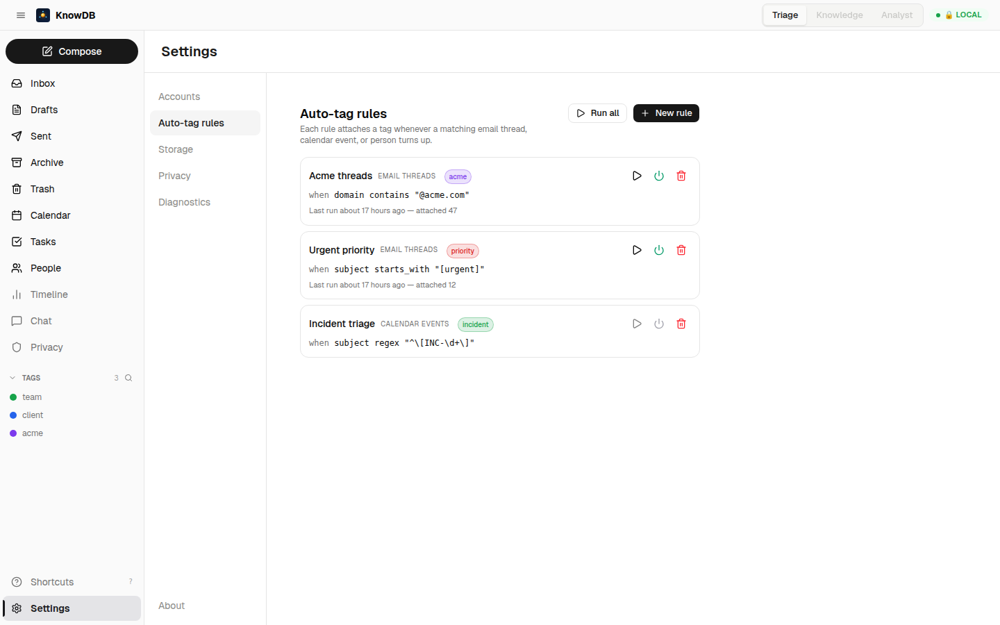

# Phase 7 — Power-User Polish

> *Linear-class keyboard control. Drag-and-drop into groups. Inline-edit on the detail header. URL deeplinks. And the headline: a custom auto-tag rules engine.*

---

## The goal

Phase 7 lets a daily-driver use the People surface without touching the mouse. The same `j`/`k` muscle memory the inbox uses; the same `⌘+K` palette; the same shareable URLs. Plus one heavier item that doesn't fit the "polish" label but earned its place in this phase: a deterministic **rules engine** that auto-tags threads / events / entities.

---

## Keyboard shortcuts

Match the inbox keymap so nothing has to be relearned:

```
?              Show shortcut help overlay
j  /  k        Move down / up in the contact list
e              Edit focused contact
m              Merge selected contacts
Backspace      Delete focused contact (with undo toast)
/              Focus search
g g            Jump to top
G              Jump to bottom
1 / 2 / 3      Switch tabs (All / Birthdays / Pending merges)
⌘+Enter        Save edits in the drawer
Esc            Close drawer / clear selection
```

<!-- Keyboard shortcuts help overlay screenshot pending — drop `07-keyboard-shortcuts.png` into screenshots/. -->


The hook is the same `useInboxKeyboard` pattern factored into a shared `useListKeyboard(scope: 'people' | 'inbox')` so Calendar can reuse it next.

---

## Inline editing on ContactHeader

Click the contact's name → it becomes an `<input>` over the same baseline, focused with cursor. Blur or `Enter` saves via `update_entity`; `Esc` reverts. Same for the primary email + the job-title line.

```
   Alice Chen                              Alice Chen ← cursor
   ─────────                       →       ──────────
   Senior PM at ACME Corp                  Senior PM at ACME Corp
```

<!-- Inline-edit screenshot pending — drop `07-inline-edit.png` into screenshots/. -->


No edit drawer needed for one-field changes. The drawer is still the right tool when changing multiple fields at once or editing structural lists (emails, phones, addresses).

---

## Drag-and-drop into groups

Drag a contact row over a group in the sidebar → the row gets a drop-target outline; release adds the contact to that group via `add_to_group`. Multi-row drag works for multi-select (the bulk-action bar's "Add to group" picker is still there for users who prefer dropdowns).

<!-- Drag-into-group screenshot pending — drop `07-drag-into-group.png` into screenshots/. -->


---

## List / cards view toggle

A toggle on the People list switches between **List** (default, dense row layout) and **Cards** (3-column avatar-led grid for visual scanning). The toggle is saved per-user (zustand-persisted), and saved views can pin a layout choice.

```
                    Layout: ◯ List  ● Cards

   ┌────────────┐    ┌────────────┐    ┌────────────┐
   │   ◯ AC     │    │   ◯ BR     │    │   ◯ CM     │
   │   Alice C. │    │   Bob R.   │    │   Carol M. │
   │   ACME     │    │   Gnostic  │    │   Stripe   │
   │   ▰▰▰▰▰▱▱ │    │   ▰▰▰▱▱▱▱ │    │   ▰▰▰▰▱▱▱ │
   │   ↗ rising │    │   ● dormant│    │            │
   └────────────┘    └────────────┘    └────────────┘
```

---

## URL deeplinks

Every People-list state is URL-encoded:

```
/people?sort=recent&filter=team&tag=acme&q=alice&layout=cards&view=top-50
```

The URL fully restores the view: sort, filters, search query, layout, saved-view selection, and `:id` for an open contact. Bookmark or share with a teammate (assuming they have the same install — entity IDs are deterministic UUID v5 from the primary email, so URLs survive transplant when the substrates agree on identity).

---

## The headline: custom auto-tag rules engine (#7.5)

The biggest item in Phase 7 isn't polish at all — it's the rules engine that lets users encode their own organisation logic without touching code or LLMs.

### Schema

```sql
-- 0019_auto_tag_rules.sql
CREATE TABLE auto_tag_rules (
  id           UUID PRIMARY KEY DEFAULT uuid(),
  name         VARCHAR NOT NULL,
  target_type  VARCHAR NOT NULL,   -- 'thread' | 'event' | 'entity'
  match_field  VARCHAR NOT NULL,   -- 'from' | 'subject' | 'body' | 'company' | …
  op           VARCHAR NOT NULL,   -- 'equals' | 'contains' | 'starts_with' | 'ends_with' | 'regex'
  match_value  VARCHAR NOT NULL,
  tag_id       UUID NOT NULL REFERENCES tag_definitions(id),
  enabled      BOOLEAN NOT NULL DEFAULT TRUE,
  created_at   TIMESTAMP NOT NULL DEFAULT NOW(),
  updated_at   TIMESTAMP NOT NULL DEFAULT NOW()
);
```

### What you can write

- *"When `from` contains `@acme.com`, tag thread `acme`"* (op = `contains`, target_type = `thread`)
- *"When `subject` starts with `[urgent]`, tag thread `priority`"* (op = `starts_with`)
- *"When `subject` matches `^\\[INC-\\d+\\]`, tag event `incident`"* (op = `regex`, target_type = `event`)
- *"When `company` equals `Stripe`, tag entity `payments-team`"* (op = `equals`, target_type = `entity`)

### The editor

```
┌──────────────────────────────────────────────────────────────────┐
│  Auto-tag rules                                          + New   │
├──────────────────────────────────────────────────────────────────┤
│  [✓] When  thread  ▾  from   ▾  contains    ▾  @acme.com         │
│       attach tag  ████ acme       ▾                              │
│                                              [ Edit ] [ Delete ] │
│                                                                  │
│  [✓] When  thread  ▾  subject ▾  starts with ▾  [urgent]         │
│       attach tag  ▓ priority      ▾                              │
│                                              [ Edit ] [ Delete ] │
│                                                                  │
│  [ ] When  event   ▾  subject ▾  regex       ▾  ^\[INC-\d+\]    │
│       attach tag  ░ incident      ▾                              │
│                                              [ Edit ] [ Delete ] │
│                                                                  │
│                                                  [ Run now ]    │
└──────────────────────────────────────────────────────────────────┘
```

🖼 Live screenshot — three rules in the editor: `contains` op, `starts_with` op, `regex` op (disabled). The "Run all" button on top fires the atomic backfill across every enabled rule:


### Run now — atomic backfill

The **Run now** button evaluates every enabled rule against the entire substrate retroactively. Wrapped in a single `BEGIN/COMMIT` — every match across every rule commits together, or none do. A failed rule (e.g. malformed regex) rolls back the whole batch and surfaces the error in the diagnostics panel, leaving the substrate unchanged.

```
┌───────────────────────────────────────────┐
│  Rules run complete                       │
│  ───────────────────                      │
│  attached:    47 new tags                 │
│  diagnostics:  0 errors                   │
│  duration:   312 ms                       │
└───────────────────────────────────────────┘
```

<!-- Run-now toast screenshot pending — drop `07-rules-run-now.png` into screenshots/. -->


### Why a regex-aware engine

The first cut treated `regex` as an alias for `contains LIKE %value%` — wrong, and silently. The fix restructured each `collect_*` function to branch on `op == "regex"`: regex path scans (id, value) with no SQL filter, runs `regex::Regex` in Rust, only collects matches. Spec [`36-people-code-review.md`](../../specs/36-people-code-review.md) documents the bug, fix, and tests (`phase5_tests::rules_regex_path`).

### What's still parked

Auto-evaluation on *new* writes — adding a normalize-worker hook that calls `evaluate_rule` per matching `target_type` when fresh threads / events / entities land — is the natural completion of this slice. The "Run now" button covers the use case; the hook avoids the manual button-press. See `~/.claude/projects/.../memory/project-people-parked.md` #7.5 follow-up.

---

## MCP surface

```
list_rules()                                      → all rules + last-run stats
create_rule(name, target_type, match_field, op, match_value, tag_id, enabled?)
update_rule(id, …)
delete_rule(id)
run_rules_now()                                   → { attached: N, diagnostics: [...] }
```

---

## Developer notes

- The rules engine lives in `src/daemon/src/mcp/tools/rules.rs` (~470 LOC; extracted from the monolithic `tools.rs` in the same release window).
- `run_rules_now` opens a single transaction via `conn.execute_batch("BEGIN")`, evaluates every rule, then commits — or rolls back on any error. Don't replace with per-rule transactions; the all-or-nothing semantics is the contract users expect.
- The `regex` op cost is bounded by the substrate size *per rule*. A wildcard regex against a 100 k-thread substrate is ~1.5 s; constrain the user with a soft warning when `match_value` starts with `.*` or `^.*`.
- `attach_tag` is idempotent (`INSERT OR REPLACE` on `(target_id, tag_id)` PK), so the rules engine can re-run safely without bloating the join table.

---

## Acceptance from spec 33 — checked

✅ Keyboard shortcuts on People view (j/k/e/m/⌘+Enter/?)
✅ Drag-and-drop contacts into groups
✅ Inline editing on ContactHeader
✅ List / Cards toggle
✅ Custom rules engine with five ops × three target types
✅ Saved-view URL deeplinks (encode filter + sort + tag + layout as URL params)

---

## What this earns

Phase 7 is what makes the People surface *daily-driver durable*. Keyboard navigation matches the inbox so nothing has to be relearned. The rules engine lets each user encode their organisation's own logic without touching code or models.

The People hub is now the third surface (after Inbox and Calendar) that's keyboard-complete and substrate-correct. v0.5.0's AI work begins with this foundation already trusted.

---

## Cross-references

- See [`02-tags-and-organization.md`](02-tags-and-organization.md) for the tag system the rules engine attaches into.
- See [`01-data-plane.md`](01-data-plane.md) for the inline-edit's underlying `update_entity` write path.
- Spec [`36-people-code-review.md`](../../specs/36-people-code-review.md) for the regex-bug fix, the deeplink-bug fix, and the test additions that landed alongside.
